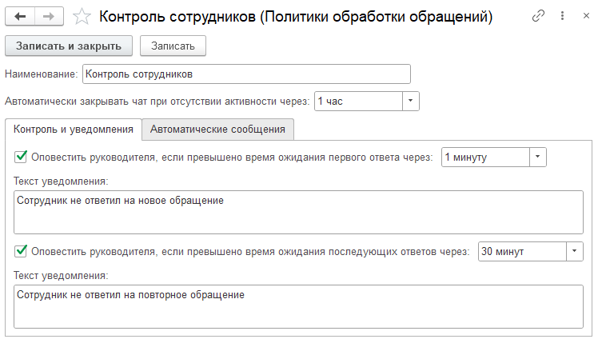

## Политика обработки

Политика обработки определяет правила автоматизации работы с обращениями в очереди. Указывается в
параметрах очереди и позволяет применять различные сценарии обработки входящих сообщений.

{.miko-art}

#### Параметры политики обработки

Автоматическое закрытие чата
: Система автоматически закрывает обращение после заданного периода отсутствия активности. Позволяет поддерживать
список открытых обращений в актуальном состоянии. Доступный диапазон настройки — от 1 часа до 1 месяца.

Контроль и уведомления
: Система контролирует время ответа операторов на входящие сообщения. Если в течение заданного времени по обращению
не будет отправлен ответ, руководителю очереди будет направлено уведомление.

Автоматические сообщения
: Система может автоматически отправлять сообщения в чат при наступлении следующих событий:
- поступление нового обращения;
- отсутствие свободных операторов;
- закрытие обращения.
