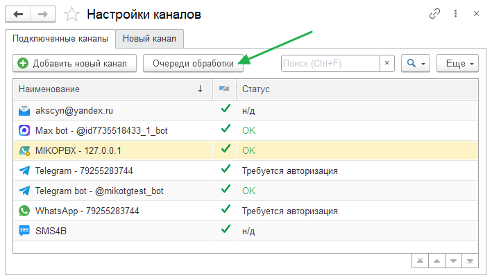

## Назначение очередей обработки

Вы можете поменять ранее выбранную очередь для обработки сообщений канала.
Находясь в окне подключенных каналов нажмите кнопку [!badge Очереди обработки].

{.miko-art}

В открывшемся окне можно назначить новую очередь для каждого из подключенных каналов.
