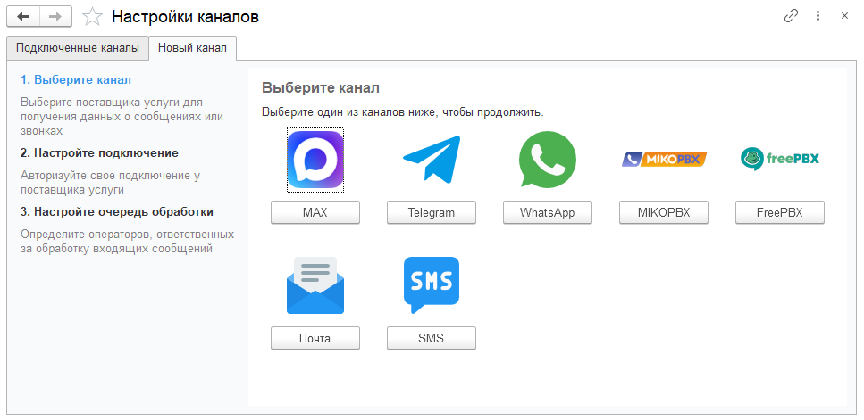

Каналы связи — это способы подключения средств коммуникации к вашей системе.

## Виды каналов

- **Мессенджеры** — WhatsApp, Telegram и MAX. Подключение персональных аккаунтов или использование ботов для ведения диалогов с клиентами в едином интерфейсе.
- **Телефония** — Интеграция с IP-АТС для обработки входящих и исходящих звонков. Все звонки фиксируются в журнале с
подробной детализацией и записями разговоров.
- **Электронная почта** — Обработка заявок, поступающих через email, организованная по принципу тикетной системы.

## Добавление нового канала

>>> Откройте окно выбора канала
{.miko-man}
В панели разделов выберите [!badge Контакт-центр] :icon-chevron-right: [!badge Настройки] :icon-chevron-right: [!badge Каналы связи].
Далее нажмите кнопку [!badge Добавить новый канал].

>>> Выберите канал и настройте подключение
{.miko-art}
 
Выберите один из доступных для подключения каналов и заполните его настройки. Подробнее о настройках подключения
можно прочитать в соответствующих разделах: 
 - [Мессенджер MAX](../messenger/max.md)
 - [Мессенджер WhatsApp](../messenger/whatsapp.md)
 - [Мессенджер Telegram](../messenger/telegram.md)
 - [Электронная почта](../messenger/email.md)

!!!info Телефония
Если модуль интеграции установлен на IP-АТС, то канал телефонии подключается автоматически.
Дополнительный канал телефонии на текущий момент подключить невозможно.
!!!

>>> Настройте очередь обработки
На выбранную [!badge очередь] автоматически назначаются все новые обращения. Помимо этого, к обращениям в этой очереди
может применяться дополнительный контроль и автоматизация, если указана [политика обработки сообщений](queues.md).
>>>
 
{{ include "queue-manage.md" }}
