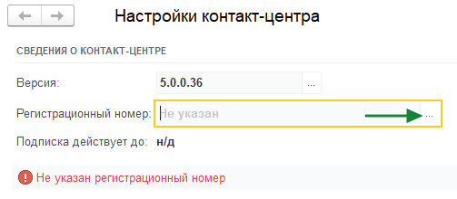
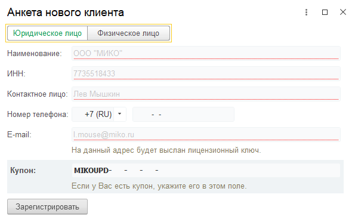
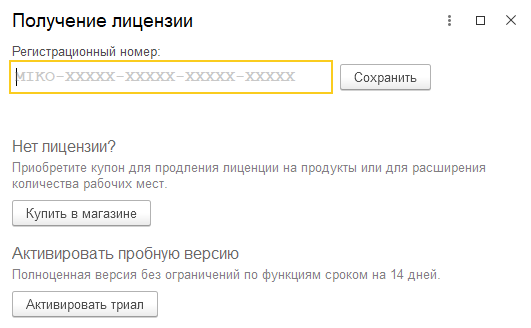
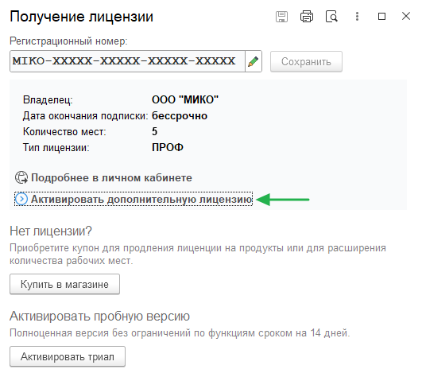

В этом разделе указано, как перенести ранее полученный регистрационный номер или получить новый. А также об
активации дополнительных рабочих мест и продлении срока действия подписки.

#### Какое действие хотите выполнить?
 - [Получить бесплатные 14 дней](#%D0%B0%D0%BA%D1%82%D0%B8%D0%B2%D0%B0%D1%86%D0%B8%D1%8F-%D0%BE%D0%B7%D0%BD%D0%B0%D0%BA%D0%BE%D0%BC%D0%B8%D1%82%D0%B5%D0%BB%D1%8C%D0%BD%D0%BE%D0%B3%D0%BE-%D0%BF%D0%B5%D1%80%D0%B8%D0%BE%D0%B4%D0%B0)
 - [Ввести регистрационный номер от предыдущей версии](#%D0%B2%D0%B2%D0%BE%D0%B4-%D1%80%D0%B5%D0%B3%D0%B8%D1%81%D1%82%D1%80%D0%B0%D1%86%D0%B8%D0%BE%D0%BD%D0%BD%D0%BE%D0%B3%D0%BE-%D0%BD%D0%BE%D0%BC%D0%B5%D1%80%D0%B0)
 - [Продлить действие подписки](#%D0%B0%D0%BA%D1%82%D0%B8%D0%B2%D0%B0%D1%86%D0%B8%D1%8F-%D0%BA%D1%83%D0%BF%D0%BE%D0%BD%D0%B0)

## Активация ознакомительного периода

При первом запуске можно активировать ознакомительный период и бесплатно использовать программу в течение 14 дней.

>>> Откройте анкету нового пользователя.
{.miko-man}
В панели разделов выберете
[!badge Контакт-центр|secondary] :icon-chevron-right: [!badge Настройки|secondary] :icon-chevron-right: [!badge Настройки контакт-центра|secondary].
Далее в поле [!badge Регистрационный номер|secondary] нажмите кнопку [!badge icon="kebab-horizontal" variant="secondary"].

{.miko-art}

В новом окне нажмите [!badge Активировать триал|secondary].

>>> Заполните анкету
Укажите данные своей организации и информацию для связи.

{.miko-art}

!!!tip
**Совет:** Если вы только что приобрели продукт, у вас на руках будет [!badge купон|secondary].
Его можно сразу активировать, указав в соответствующем поле.
!!!

Нажмите [!badge Зарегистрировать|secondary] для отправки анкеты. На указанный email будет продублирован
регистрационный номер.
>>>

## Ввод регистрационного номера

Регистрационный номер необходим для корректной работы программы.

>>> Откройте форму получения лицензии.
{.miko-man}
В панели разделов выберете
[!badge Контакт-центр|secondary] :icon-chevron-right: [!badge Настройки|secondary] :icon-chevron-right: [!badge Настройки контакт-центра|secondary].
Далее в поле [!badge Регистрационный номер|secondary] нажмите кнопку [!badge icon="kebab-horizontal" variant="secondary"].

>>> Укажите регистрационный номер
Вставьте свой [!badge регистрационный номер|secondary] в соответствующее поле и нажмите кнопку [!badge Сохранить|secondary].

{.miko-art}
>>>

## Активация купона

После приобретения лицензии нужно активировать полученный купон. Данные купона будут добавлены к вашему
регистрационному номеру, продляя срок подписки или увеличивая количество рабочих мест, в зависимости от типа купона.

>>> Откройте форму получения лицензии.
{.miko-man}
В панели разделов выберете
[!badge Контакт-центр|secondary] :icon-chevron-right: [!badge Настройки|secondary] :icon-chevron-right: [!badge Настройки контакт-центра|secondary].
Далее в поле [!badge Регистрационный номер|secondary] нажмите кнопку [!badge icon="kebab-horizontal" variant="secondary"].

>>> Перейдите к активации купона
В открывшемся окне нажмите [!badge Активировать дополнительную лицензию|secondary].
 
{.miko-art}

>>> Активируйте купон

Введите [!badge купон|secondary] и нажмите кнопку [!badge Активировать|secondary].

!!!tip
**Совет:** Ключи легко различать по буквенному префиксу. У регистрационного номера всегда есть префикс **MIKO-**,
а у купона **MIKOUPD-**.
!!!
>>>
