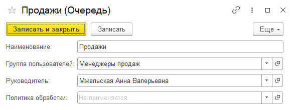

Очереди предназначены для распределения входящих обращений между сотрудниками. Сообщения из мессенджеров и
электронные письма направляются в очередь, где ожидают обработки назначенными операторами.

{.miko-art}

#### Параметры очереди

Группа пользователей
: Список операторов, которым назначается обработка обращений в очереди.
При изменении состава группы, эти изменения будут также автоматически применены к очереди.

Руководитель
: Cотрудник, получающий контрольные уведомления, если это предусмотрено политикой обработки. 
Если руководитель также должен обрабатывать обращения, его необходимо включить в группу пользователей.

Политика обработки
: Набор правил автоматизации, применяемых к обращениям в данной очереди.

{{ include "queue-manage.md" }}
{{ include "policy.md" }}
