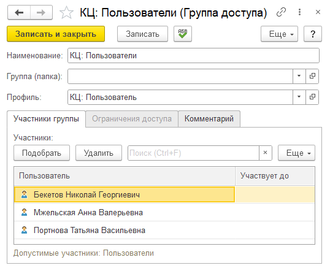
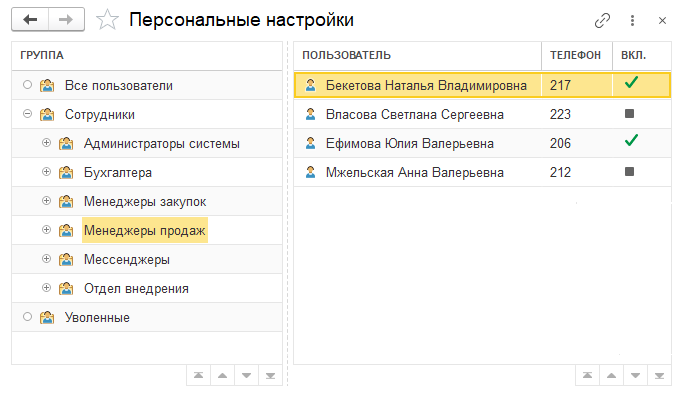

Для работы с расширением в 1С пользователям необходимо назначить соответствующие права доступа и подключить
подсистему контакт-центра в персональных настройках.

## Подключение пользователей

Чтобы пользователь мог работать в подсистеме 1С, необходимо выполнить следующие действия:

>>> Добавьте пользователя в группу доступа
{.miko-man}
В панели разделов выберите
[!badge Контакт-центр] :icon-chevron-right: [!badge Настройки] :icon-chevron-right: [!badge Пользователи и права доступа].

В системе предусмотрено два профиля доступа:
- **КЦ: Администратор** — полный доступ к настройкам системы, управлению пользователями, каналами связи и всем функциям контакт-центра.
- **КЦ: Пользователь** — доступ к обработке обращений, работе с чатами, звонками, отчетами.

Для начала работы потребуется создать группы доступы с предустановленными профилями:
1. Нажмите кнопку [!badge Добавить] и выберите  [!badge Добавить группу доступа пользователей контакт-центра].
2. Укажите [!badge Наименование] и подберите [!badge Участников] группы. Профиль заполняется автоматически.

{.miko-art}

3. Нажмите кнопку [!badge Записать и закрыть].
4. (_Опционально_) Повторите аналогичное действие, создав группу для администраторов.
!!!info Полные права
Пользователи с полными правами уже имеют доступ ко всей подсистеме, включая функции 
администрирования. Поэтому создание отдельного профиля для администраторов может быть не обязательным.
!!!

>>> Включите подстистему для пользователей

В панели разделов выберите
[!badge Контакт-центр] :icon-chevron-right: [!badge Настройки] :icon-chevron-right: [!badge Персональные настройки].

Персональные настройки могут быть назначены:
- Всем пользователям одновременно
- Группе пользователей
- Персонально

{.miko-art}

В колонке Вкл. (включено) указывается, включена ли подсистема для пользователя.
Символ  означает, что подсистема включена персонально.
А символ  — для группы или всех пользователей.

!!!info Порядок применения
Система сначала ищет настройки пользователя. Если они не заданы, то настройки группы,
в которой состоит пользователь. В последнуюю очередь выбираются настройки для всех пользователей.
!!!

Для включения подсистемы:
1. Выберите **группу** или **пользователя** двойным кликом.
2. В открывшемся окне установите тублер [!badge Использовать контакт-центр] в положение включено.
3. Укажите [!badge Тип лицензии] ПРОФ или базовая. Если у вас приобретено оба типова лицензии,
вы можете выбирать, кому из пользователей какой тип необходим для работы. На время **ознакомительного периода** укажите тип ПРОФ.
4. Нажмите кнопку [!badge Сохранить].

>>> (_Опционально_) Назначьте внутренние номера
{.miko-man}

Для работы телефонии требуется указать внутренний номер пользователя:
 
1. Выбере пользователя и нажмите клавишу [!badge F2].
2. В поле [!badge Телефон] укажите внутренний номер пользователя.
3. Сохраните изменения нажав [!badge Записать].
>>>
