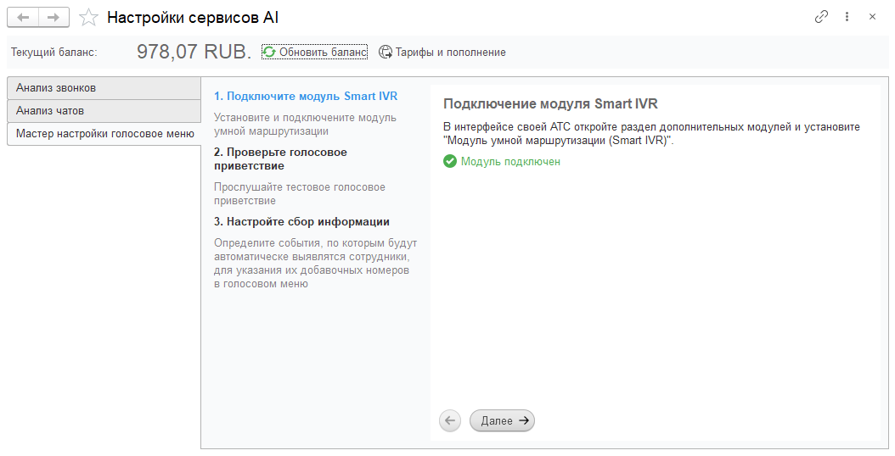
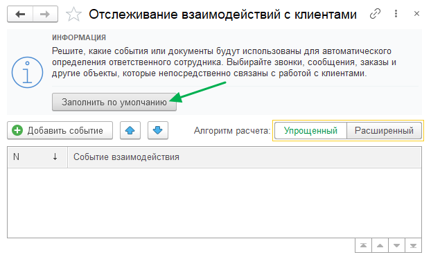

Система накапливает сведения о взаимодействиях клиентов с сотрудниками компании и на их основе определяет
наиболее подходящий сценарий маршрутизации для каждого клиента.

При входящем звонке IP-АТС обращается к 1С за текстом голосового приветствия.
Полученный текст передаётся в сервис синтеза речи (TTS), после чего воспроизводится клиенту в виде голосового меню.

Если клиент не выбирает ни один из предложенных вариантов, звонок переводится на номер по умолчанию.
Если во время обработки вызова недоступна 1С или возникает ошибка при синтезе речи,
звонок переводится на аварийный номер.

## Настройка авто IVR

>>> Установите модуль умной маршрутизации на IP-АТС

=== MIKOPBX
На вкладке [!badge Маркетплейс] найдите и установите [!badge Модуль умной маршрутизации вызовов (Smart IVR)].
После установки модуль появится на вкладке [!badge Установленные модули].

==- FreePBX
Инструкция дополняется...
===

>>> Настройте модуль
1. Укажите следующие параметры:

   Версия подсистемы
   : Выберите [!badge Версия 5.0].

   Номер по-умолчанию
   : Номер, на который будет переведён звонок, если абонент не наберёт добавочный номер
   в течение заданного количества повторов приветствия.

   Номер, куда отправим звонок в случае сбоев связи с 1С и TTS
   : Номер, на который будет переведён звонок, если во время обработки вызова возникнет ошибка при обращении к 1С
   или сервису синтеза речи (аварийный маршрут).

2. Сохраните изменения.

>>> Настройте правило маршрутизации
Выберите провайдера, через которого при входящем звонке будет воспроизводиться голосовое меню.

=== MIKOPBX
{.miko-man}
1. Откройте раздел [!badge Маршрутизация] :icon-chevron-right: [!badge Входящие маршруты].
2. Выберите маршрут входящего звонка. В поле [!badge Вызов будет переадресован на] установите значение
[!badge Модуль Smart IVR].
3. Сохраните изменения.

==- FreePBX
Инструкция дополняется...
===

>>> Откройте мастер настройки в 1С
{.miko-man}
1. В панели разделов выберите [!badge Контакт-центр] :icon-chevron-right: [!badge Сервисы AI] :icon-chevron-right: [!badge Настройки сервисов AI].
2. В открывшемся окне выберите [!badge Мастер настройки голосового меню].

{.miko-art}

!!!info Информация 
Для использования сервиса требуется положительный **текущий баланс**. Для пополнения баланса нажмите
кнопку [!badge Тарифы и пополнение].
!!!

3. Если модуль на IP-АТС успешно подключен к 1С, то на экране появится соответствующее сообщение.
Нажмите [!badge Далее].
4. Прослушайте тестовое голосовое приветствие на своем телефоне. Нажмите [!badge Далее].

>>> Настройте регистрируемые события
Система анализирует документы, чтобы определить сотрудника, ответственного за взаимодействие с клиентом.

{.miko-art}

1. Нажмите кнопку [!badge Регистрируемые события].
2. В открывшемся окне нажмите [!badge Заполнить по умолчанию].

Система выполнит базовую настройку регистрируемых событий.
При необходимости вы сможете изменить эти параметры позже.

>>> Включите задание обработки документов
Для обработки документов должно быть включено соответствующее регламентное задание.

{.miko-man}
1. В панели разделов выберите [!badge Контакт-центр] :icon-chevron-right: [!badge Настройки] :icon-chevron-right: [!badge Регламентные задания].
2. Включите задание [!badge Обработка очереди документов].
     
!!!success Готово
Системе потребуется некоторое время для накопления данных об ответственных сотрудниках.
!!!
>>>
