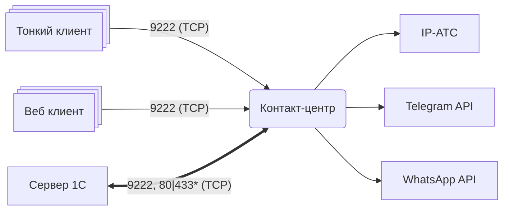

Контакт-центр состоит из **расширения для 1С:Предприятие** и **модуля интеграции**. Подключение мессенджеров
и IP-АТС к 1С осуществляется через модуль. Он играет роль центрального узла в контакт-центре и
выполняет предварительную обработку данных прежде, чем они будут загружены в 1С.

##### Задачи модуля интеграции:
- Выступать в качестве клиентского приложения при работе с мессенджерами.
- Собирать информацию о звонках с IP-АТС.
- Управлять лицензиями.
- Выполнять ряд сервисных функций, вроде конвертации изображений для мессенджеров.

## Схема подключения

Между сервером 1С и модулем интеграции устанавливается двунаправленное соединение. Это основной канал передачи данных.
Данные делятся на два типа: _команды_ (позвонить, отправить сообщение и т.п.) и _события_ (новый звонок,
новое сообщение и т.п). Сервер 1С отправляет команды модулю на порт [!badge 9222|secondary] (TCP).
Модуль интеграции отправляет события серверу 1С одним из предложенных способов:
 - обращением к HTTP-сервису веб сервера 1С.
 - установкой long-poll соединения с сервером 1С.

Тонкий и веб клиенты отправляют команды модулю интеграции на порт [!badge 9222|secondary] (TCP). Здесь, например,
передаются данные требуемые для работы плеера в журнале звонков и окна мессенджера на рабочем месте пользователя.

## Выбор режима соединения

В зависимости от вашей организации сети, вы можете выбрать, каким образом сервер интеграции будет
отправлять события серверу 1С.

### Веб-сервер

Потребуется установить веб-сервер *IIS*[^1] или *Apache*[^2] и опубликовать информационную базу. При публикации
важно не забывать публиковать HTTP-сервисы расширений 1С. Если компьютеры находятся в разных подсетях, то следует
учитывать, что у веб-сервера 1С должен быть открыт порт [!badge 80|secondary] или [!badge 433|secondary]
(порты по умолчанию) для доступа из другой сети. 

### Long-poll соединение

В целом не требует дополнительной настройки. При выборе этой схемы устанавливается реверсное соединение от
сервера 1С к модулю интеграции. При таком режиме требуется только открыть доступ к порту [!badge 9222|secondary].

!!!warning
**Важно:** Long-poll соединение напрямую связано с работой регламентных заданий. При их отключении останавливается обмен
событиями с контакт-центром.
!!!

[^1]: [Настройка веб-сервера IIS](https://its.1c.ru/db/metod8dev/content/5977/hdoc)
[^2]: [Настройка веб-сервера Apache под Windows](https://its.1c.ru/db/metod8dev#content:5978:hdoc)
