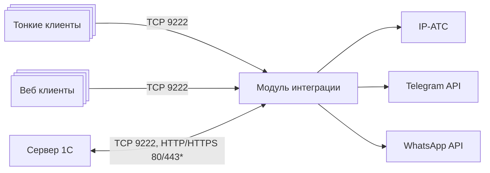

Контакт-центр включает два компонента:
- **Расширение для 1С:Предприятия** — реализует пользовательские интерфейсы и прикладную логику в 1С.
- **Модуль интеграции** — обеспечивает обмен данными между 1С, IP-АТС и мессенджерами.

Модуль интеграции выполняет следующие функции:
- прием команд от 1С;
- получение событий от внешних систем;
- преобразование и нормализация данных перед передачей в 1С;
- выполнение сервисных операций;
- управление лицензированием.

## Направления обмена

Между сервером 1С и модулем интеграции используется двусторонний обмен данными. Передаваемые данные делятся на два типа:
- **команды** — запросы от 1С к модулю интеграции;
- **события** — уведомления от модуля интеграции в 1С.

### Команды

Сервер 1С передает команды модулю интеграции по порту [!badge 9222] (TCP).

Тонкий и веб-клиенты 1С также используют порт [!badge 9222] (TCP) для прямого взаимодействия с модулем интеграции.
Этот канал применяется для функций пользовательского интерфейса, требующих доступа к модулю интеграции, включая:
- воспроизведение записей разговоров;
- работу окна мессенджера;
- выполнение служебных запросов от клиентского интерфейса.

### События

Модуль интеграции передает события в 1С одним из двух способов:
- через HTTP-сервис, опубликованный на веб-сервере 1С;
- через long-poll соединение, инициируемое сервером 1С.

### Таблица сетевых взаимодействий

{.compact}
Источник | Назначение | Протокол / порт | Назначение соединения
--- | --- | --- | ---
Сервер 1С | Модуль интеграции | TCP 9222 | Передача команд
Тонкий клиент 1С | Модуль интеграции | TCP 9222 | Функции клиентского интерфейса
Веб-клиент 1С | Модуль интеграции | TCP 9222 | Функции клиентского интерфейса
Модуль интеграции | Веб-сервер 1С | HTTP/HTTPS 80/443 | Передача событий через HTTP-сервис
Сервер 1С | Модуль интеграции | TCP 9222 | Получение событий в режиме long-poll

## Режимы доставки событий

Выбор режима передачи событий из модуля интеграции в 1С выбирается в зависимости от сетевой архитектуры
и доступности серверов.

### 1. Передача через HTTP-сервис

В этом режиме модуль интеграции передает события в 1С через HTTP-сервис, опубликованный на веб-сервере 1С.

#### Требования:
- установлен и настроен веб-сервер *IIS*[^1] или *Apache*[^2];
- информационная база 1С опубликована;
- при публикации включены **HTTP-сервисы расширения**;
- модулю интеграции доступен веб-сервер 1С по порту [!badge 80] или [!badge 443] (если используются стандартные порты).

Этот режим используется, если модуль интеграции может установить соединение с веб-сервером 1С.

### 2. Передача через long-poll соединение

В этом режиме сервер 1С устанавливает соединение с модулем интеграции по порту [!badge 9222] (TCP) и использует
его для получения событий.

#### Требования:
- серверу 1С доступен модуль интеграции по порту [!badge 9222];
- включены и выполняются регламентные задания 1С, обеспечивающие обмен.

Этот режим используется, если публикация HTTP-сервисов не применяется или если сервер 1С может установить 
исходящее соединение к модулю интеграции.

!!!warning
**Важно:** При отключении регламентных заданий 1С обмен событиями в режиме long-poll прекращается.
!!!

[^1]: [Настройка веб-сервера IIS](https://its.1c.ru/db/metod8dev/content/5977/hdoc)
[^2]: [Настройка веб-сервера Apache под Windows](https://its.1c.ru/db/metod8dev#content:5978:hdoc)
