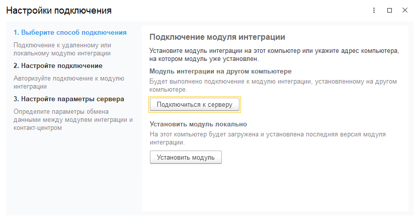
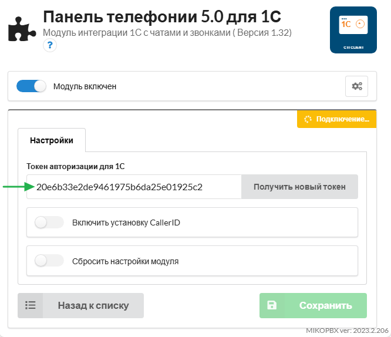

В данном разделе указаны действия, которые потребуется выполнить, прежде чем можно будет переходить к
настройке других параметров.

Предварительно должны быть установлены расширение 1С и модуль интеграции, как это указано
в разделе [установки](install.md).

## Настройка подключения

Первым делом требуется подключить 1С к модулю интеграции. Если при установке модуля был выбран способ 2
(установка на ОС Windows), то этот этап уже пройден и вы можете переходить к следующему.

>>> Откройте настройки подключения
{.miko-man}
В панели разделов выберете
[!badge Контакт-центр|secondary] :icon-chevron-right: [!badge Настройки|secondary] :icon-chevron-right: [!badge Настройки контакт-центра|secondary].
Далее [!badge Сервер интеграции|secondary] :icon-chevron-right: [!badge Настройки подключения|secondary].
На экране появится мастер настройки подключения.

{.miko-art} 

>>> Подключение к серверу

Нажмите кнопку [!badge Подключиться к серверу|secondary] и укажите параметры подключения.
[!badge Токен авторизации|secondary] расположен в модуле панели телефонии на АТС.
Откройте параметры модуля и скопируйте токен в поле 1С.

{.miko-art}

Далее нажмите кнопку [!badge Проверить подключение|secondary].

>>> Выберите режима соединения
На этом этапе нужно решить, какой тип соединения лучше подходит под вашу организацию сети. Подробно об этом
описано в разделе [архитектуры](architecture.md).
- Если long-poll, тогда нажмите кнопку [!badge Использовать онлайн-обмен|secondary].
- Если веб-сервер, тогда укажите параметры публикации информационной базы и
  нажмите кнопку [!badge Использовать веб-сервер|secondary].

Для завершения настройки нажмите кнопку [!badge Завершить|secondary].
>>>

## Следующие шаги

К этому моменту, если установка модуля производилась на IP-АТС, то уже будут подключены функции телефонии.
Далее рекомендуем обратить внимание на следующие разделы документации:

1. [Ввод лицензионного ключа или активация ознакомительного периода](../administration/license-management.md)
2. [Настройка пользователей и прав](../administration/users_and_rights.md)
3. [Подключение аккаунтов или ботов для работы с мессенджерами](../administration/channels.md)
4. [Настройка очередей и политик обработки обращений](../administration/queues.md)
