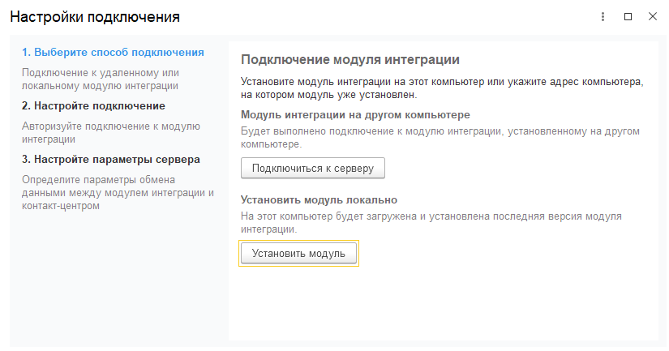
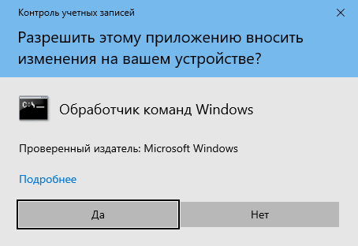

Установка выполняется в два этапа: **расширение 1С** и **модуль интеграции**. Подробнее о назначении модуля интеграции
можно прочитать на странице [Архитектура](architecture.md).

## Расширение 1С

Для каждой конфигурации предназначено свое расширение. Список поддерживаемых конфигураций приведен в
[системных требованиях](requirements.md).

>>> Скачайте установщик расширений
Это внешняя обработка для 1С, которая поможет скачать правильное расширение под вашу конфигурацию.
[!file Установщик расщирений.epf](https://releases.mikopbx.com/releases/v1/1c/getModuleFile/PT50_Installer/latest)

>>> Откройте обработку в 1С
{.miko-man}
Нажмите кнопку [!badge icon="../assets/icons/ones-menu-down.svg"] и выберите команду
[!badge Файл] :icon-chevron-right: [!badge Открыть] или нажмите клавиши
[!badge Ctrl] + [!badge O]. В открывшемся окне укажите путь к скаченному файлу.
Обработка проверит конфигурацию и выдаст список подходящих расширений.

>>> Установите расширение
После установки расширения **перезапустите** сеанс 1С. В панели разделов появится новый пункт **Контакт-центр**.
>>>

## Модуль интеграции

Модуль интеграции может быть установлен на IP-АТС. Если вы планируете использовать звонки или переходите с
**Панели телефонии (редакция 4)**, то это предпочтительный вариант.
Альтернативный вариант — установка модуля как отдельного приложения Windows. Такой вариант подойдет,
если не требуется подключать телефонию.

### Способ 1 (установка на IP-АТС)

Ниже приведены варианты установки для двух IP-АТС: [MIKOPBX](#установка-модуля-на-mikopbx) и
[FreePBX](#установка-модуля-на-freepbx). Выбирайте подходящую для вас инструкцию.

#### Установка модуля на MIKOPBX

>>> Подключите маркетплейс
{.miko-man}
Если вы впервые открываете раздел маркетплейса в MIKOPBX, то потребуется пройти регистрацию нового пользователя.
Откройте раздел [!badge Модули] :icon-chevron-right: [!badge Маркетплейс модулей].
Если у вас уже есть **лицензионный ключ**, его можно указать в соответствующем поле. Если ключа нет,
заполните форму регистрации, указав название организации и свои контактные данные.
После чего вы получите новый лицензионный ключ с триалом на **14** дней.

>>> Установите модуль
На вкладке [!badge Маркетплейс] найдите и установите [!badge Панель телефонии 5.0 для 1С].
После установки модуль появится на вкладке [!badge Установленные модули].
>>>

#### Установка модуля на FreePBX

>>> Откройте раздел установки модулей
{.miko-man}
Выберите команду [!badge Admin] :icon-chevron-right: [!badge Module Admin].
Далее нажмите кнопку [!badge Upload modules].

>>> Загрузите модуль
В поле [!badge Download remote module] вставьте нижеприведенную ссылку и нажмите кнопку
[!badge Download].
```html
https://releases.mikopbx.com/releases/v1/freepbx/getModuleFile/pt1coutpanel/latest.tgz
```

>>> Инструкция дополняется...
Инструкция дополняется...
>>>

### Способ 2 (установка на ОС Windows)

Этот вариант установки подойдет, если не используете телефонию и работаете, например, в терминале Windows.
Установка модуля производится непосредственно из 1С.

!!!warning Повышение прав
Убедитесь, что у вас есть права администрирования на компьютере, где будет производиться установка. 
!!!

#### Установка модуля

>>> Откройте настройки подключения
{.miko-man}
В панели разделов выберите
[!badge Контакт-центр] :icon-chevron-right: [!badge Настройки] :icon-chevron-right: [!badge Настройки контакт-центра].
Далее [!badge Сервер интеграции] :icon-chevron-right: [!badge Настройки подключения].
На экране появится мастер настройки подключения.

{.miko-art}

>>> Установите модуль

Нажмите кнопку [!badge Установить модуль] и дождитесь окончанию его установки.
Модуль будет установлен на текущем компьютере как служба Windows.
Во время установки могут несколько раз появляться уведомления от системы,
на которые нужно отвечать [!badge Да].

{.miko-art}

По окончанию установки нажмите [!badge Далее].

>>> Выберите режим соединения
На этом этапе нужно решить, какой тип соединения лучше подходит под вашу организацию сети.
Подробнее см. [Архитектура](architecture.md).
 - Если long-poll, тогда нажмите кнопку [!badge Использовать онлайн-обмен].
 - Если веб-сервер, тогда укажите параметры публикации информационной базы и
нажмите кнопку [!badge Использовать веб-сервер].

Для завершения установки нажмите кнопку [!badge Завершить].
>>>

