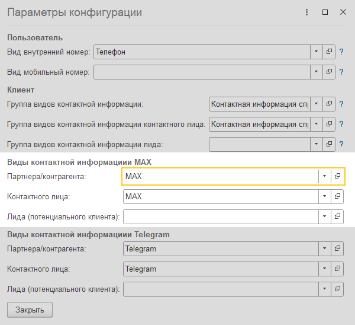

Инструкция описывает процесс подключения мессенджера MAX к контакт-центру.

## Подключение

>>> Откройте окно выбора канала
{.miko-man}
В панели разделов выберите [!badge Контакт-центр] :icon-chevron-right: [!badge Настройки] :icon-chevron-right: [!badge Каналы связи].
Далее нажмите кнопку [!badge Добавить новый канал] и выберите [!badge MAX].

>>> Укажите параметры подключения
1. Нажмите кнопку [!badge Подключить MAX] и введите [!badge Токен].
2. Для завершения настройки нажмите [!badge Проверить подключение].

!!!question Где взять токен?
Для получения токена нужно создать бота. Предварительно потребуется подключиться к платформе MAX для партнёров
и пройти верификацию. Подробнее на сайте https://dev.max.ru/docs/chatbots/bots-create 
!!!
>>>

## Настройка контактной информации

Требуется указать виды контактной информации, под которыми в системе будут сохраняться идентификаторы пользователей
мессенджера MAX. Это необходимо для их последующей идентификации.

>>> Откройте параметры конфигурации
{.miko-man}
В панели разделов выберите [!badge Контакт-центр] :icon-chevron-right: [!badge Настройки] :icon-chevron-right: [!badge Настройки контакт-центра].
Далее в группе [!badge Управление подсистемой] нажмите [!badge Параметры конфигурации].

>>> Заполните виды контактной информации
{.miko-art}
Заполните поля параметров в группе [!badge Виды контактной информации MAX]. 
>>>

## Включите регламентные задания

Для синхронизации сообщений требуется обеспечить работу регламентных заданий.

>>> Откройте настройки регламентных заданий
{.miko-man}
В панели разделов выберите [!badge Контакт-центр] :icon-chevron-right: [!badge Настройки] :icon-chevron-right: [!badge Регламентные задания].

>>> Заполните виды контактной информации
Включите следующие регламентные задания (при необходимости настройте их расписание):
- **Синхронизация сообщений мессенджера**.
- **Обработка очереди документов**.
>>>
