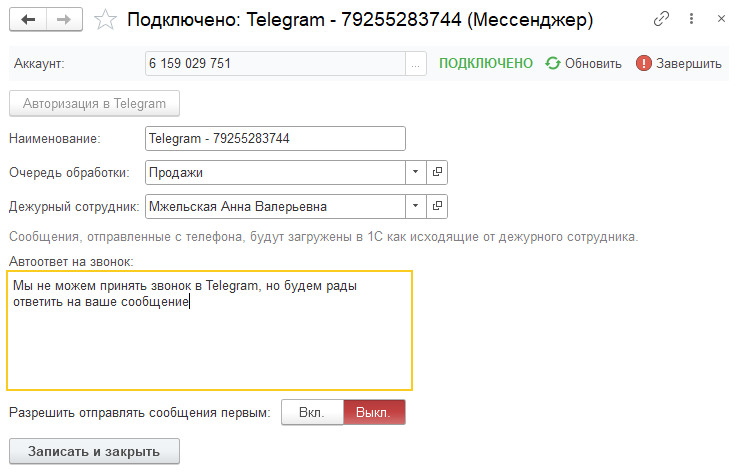

## Аккаунт мессенджера

Для мессенджеров, подключаемых через аккаунт, например [Telegram](telegram.md) или [WhatsApp](whatsapp.md),
доступны дополнительные параметры. Они указываются непосредственно в форме аккаунта мессенджера.

{.miko-art}

#### Параметры аккаунта мессенджера

Дежурный сотрудник
: Пользователь, у которого установлен мессенджер на телефоне и подключён соответствующий аккаунт.  
Если сотрудник отвечает клиентам напрямую с телефона, такие сообщения будут загружены в 1С, а этот пользователь
будет указан автором сообщения.

Автоответ на звонок
: Текстовое сообщение, которое автоматически отправляется клиенту вместо ответа на звонок.  
Работа через мессенджеры не предполагает голосовое соединение, поэтому с помощью этого параметра можно уведомить клиента,
что общение доступно в формате переписки.

Разрешить отправлять сообщение первым
: Позволяет сотруднику контакт-центра первыми инициировать общение с клиентом.

{{ include "policy.md" }}
