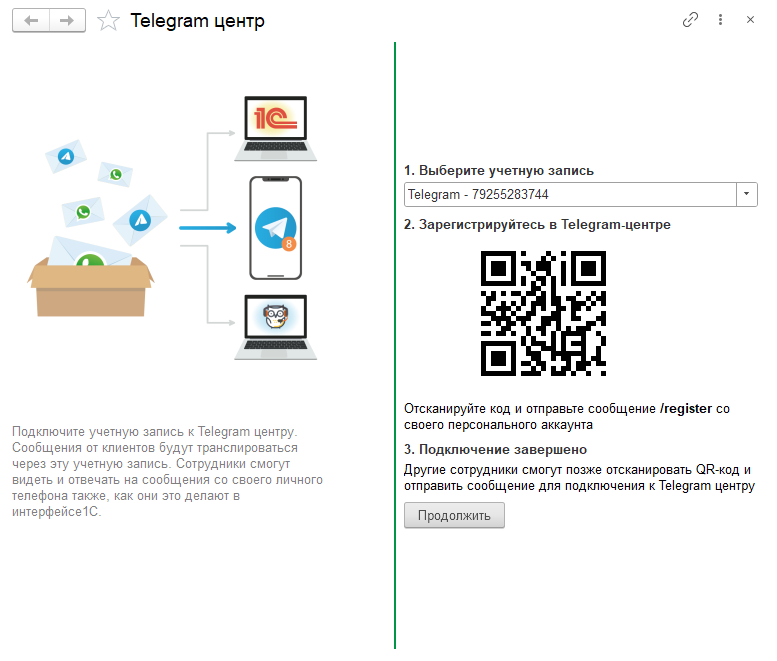

Telegram центр позволяет сотрудникам обрабатывать обращения клиентов через Telegram.
Сотрудник получает сообщения в Telegram и отвечает на них со своего телефона.
При отправке ответа система автоматически определяет исходный канал обращения и доставляет сообщение клиенту
в соответствующий мессенджер.

Telegram используется как интерфейс сотрудника. Клиент продолжает общение в том канале,
из которого было получено исходное сообщение.

!!!info Особенности работы
- Сотрудник отвечает клиентам через личный Telegram, но сообщения отправляются клиенту в исходный канал обращения.
- Для работы можно использовать только учетную запись Telegram, подключенную в контакт-центре.
- Подключение новых сотрудников требует подтверждения администратора.
  !!!

## Подключение Telegram центра

{.miko-art}

Действия выполняются администратором системы для активации Telegram центра.

>>> Откройте Telegram центр
{.miko-man}
В панели разделов выберите [!badge Контакт-центр] :icon-chevron-right: [!badge Настройки] :icon-chevron-right: [!badge Telegram центр].

>>> Выберите учетную запись
Выберите учетную запись Telegram, подключенную в контакт-центре как аккаунт мессенджера.

>>> Сканируйте QR-код
Сканируйте QR-код камерой мобильного телефона и перейдите по ссылке в чат Telegram-бота.
В чате отправьте команду **/register**. В ответ система отправит сообщение о завершении регистрации.

!!!success Готово
Подключение Telegram центра завершено. Выбранная учетная запись будет использоваться для доставки сообщений
сотрудникам в Telegram.
!!!
>>>

## Подключение сотрудников к Telegram центру

Подключение сотрудников выполняется аналогично, но доступ начинает действовать только после
подтверждения администратором.

Сотрудник
:   >>> Откройте Telegram центр
    {.miko-man}
    В панели разделов выберите [!badge Контакт-центр] :icon-chevron-right: [!badge Настройки] :icon-chevron-right: [!badge Telegram центр].
    >>> Сканируйте QR-код
    Сканируйте QR-код камерой мобильного телефона и перейдите по ссылке в чат Telegram-бота.
    В чате отправьте команду **/register**.
    >>> Ожидайте подтверждения
    Ожидайте подтверждения администратора. После предоставления доступа в чат поступит уведомление.
    >>>

Администратор
:   >>> Откройте Telegram центр
    {.miko-man}
    В панели разделов выберите [!badge Контакт-центр] :icon-chevron-right: [!badge Настройки] :icon-chevron-right: [!badge Telegram центр].
    >>> Подтвердите подключение
    В группе [!badge Пользователи Telegram] выберите пользователя, ожидающего подключения.
    >>> Укажите пользователя 1С
    В открывшемся окне заполните поле [!badge Пользователь], чтобы сопоставить пользователя Telegram с пользователем 1С.
    Нажмите [!badge Записать] для предоставления доступа.
    !!!success Готово
    Сотрудник будет получать сообщения клиентов в Telegram.
    !!!
    >>>
