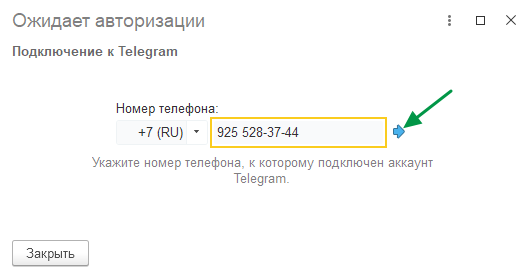
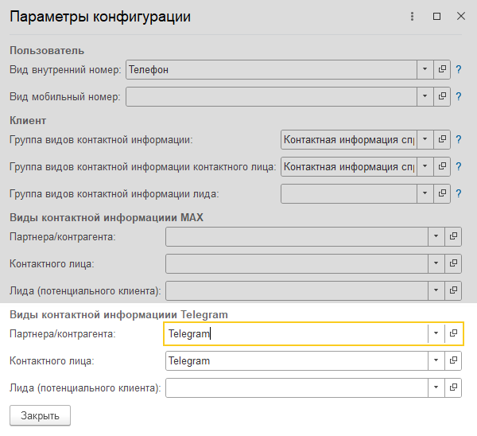

Инструкция описывает процесс подключения мессенджера Telegram к контакт-центру.

## Подключение

>>> Откройте окно выбора канала
{.miko-man}
В панели разделов выберите [!badge Контакт-центр] :icon-chevron-right: [!badge Настройки] :icon-chevron-right: [!badge Каналы связи].
Далее нажмите кнопку [!badge Добавить новый канал] и выберите [!badge Telegram].

>>> Выполните подключение
Доступно два варианта подключения мессенджера Telegram:
- Подключение персонального аккаунта.
- Подключение через Bot API.

#### Подключение аккаунта
1. Нажмите кнопку [!badge Подключить аккаунт].
2. {.blue}Введите номер своего телефона и нажмите кнопку [!badge :icon-arrow-right:].
   {.miko-art}
3. {.blue}На следующем экране введите [!badge Код подтверждения], который придет в приложении Telegram и 
   нажмите кнопку [!badge :icon-arrow-right:].

#### Подключение бота
1. Нажмите кнопку [!badge Подключить бота] и введите [!badge Токен].
2. Для завершения настройки нажмите [!badge Проверить подключение].

!!!question Где взять токен?
Для получения токена нужно создать бота.

Создание бота в Telegram:
1. Откройте в Telegram диалог с ботом @BotFather https://telegram.me/BotFather.
2. Нажмите кнопку **Start** или введите в диалоге команду **/start**.
3. Далее отправьте ему команду **/newbot**.
4. Укажите название бота. Оно будет отображаться в контактах и чатах.
5. Укажите юзернейм (username) бота. Он используется для упоминания бота и в ссылках.
   Юзернейм должен быть на латинице и обязательно заканчиваться на **bot**.
!!!
>>>

## Настройка контактной информации

Требуется указать виды контактной информации, под которыми в системе будут сохраняться идентификаторы пользователей
мессенджера Telegram. Это необходимо для их последующей идентификации.

>>> Откройте параметры конфигурации
{.miko-man}
В панели разделов выберите [!badge Контакт-центр] :icon-chevron-right: [!badge Настройки] :icon-chevron-right: [!badge Настройки контакт-центра].
Далее в группе [!badge Управление подсистемой] нажмите [!badge Параметры конфигурации].

>>> Заполните виды контактной информации
{.miko-art}
Заполните поля параметров в группе [!badge Виды контактной информации Telegram].
>>>

{{ include "messengers-tasks.md" }}
