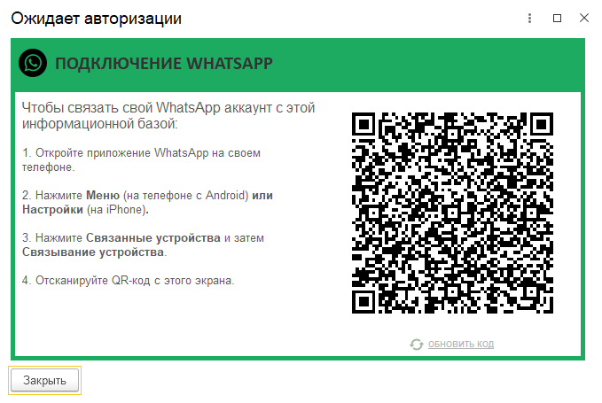

Инструкция описывает процесс подключения мессенджера WhatsApp к контакт-центру.

## Подключение

>>> Откройте окно выбора канала
{.miko-man}
В панели разделов выберите [!badge Контакт-центр] :icon-chevron-right: [!badge Настройки] :icon-chevron-right: [!badge Каналы связи].
Далее нажмите кнопку [!badge Добавить новый канал] и выберите [!badge WhatsApp].

>>> Выполните подключение
{.miko-art}
 
{.miko-man}
1. Нажмите кнопку [!badge Подключить WhatsApp].
2. Откройте приложение WhatsApp или WhatsApp Business на своем телефоне.
3. Нажмите кнопку [!badge :icon-kebab-horizontal:] (на телефоне с Android)
   или [!badge :icon-gear:] (на IPhone)
   и далее выберите [!badge Связанные устройства] :icon-chevron-right: [!badge Связывание устройства].
4. Наведите камеру телефона на QR-код.
>>>

{{ include "messengers-tasks.md" }}
