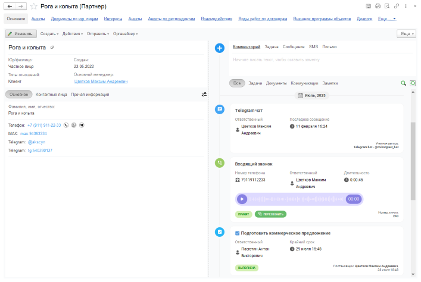
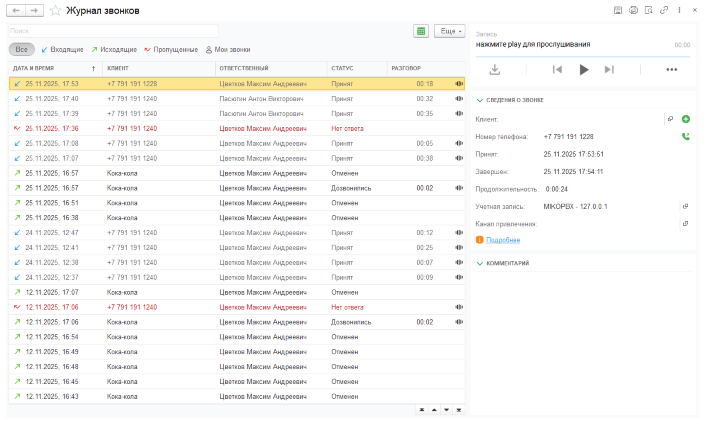
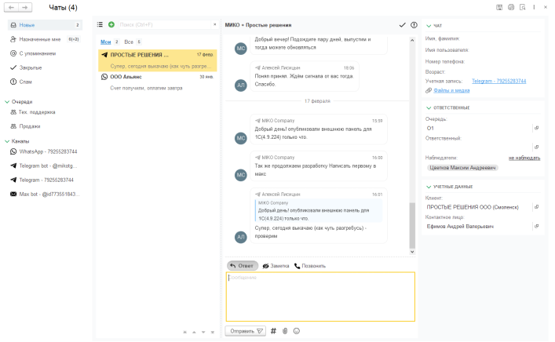
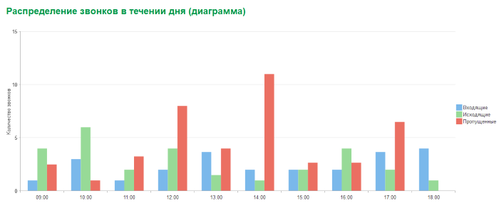
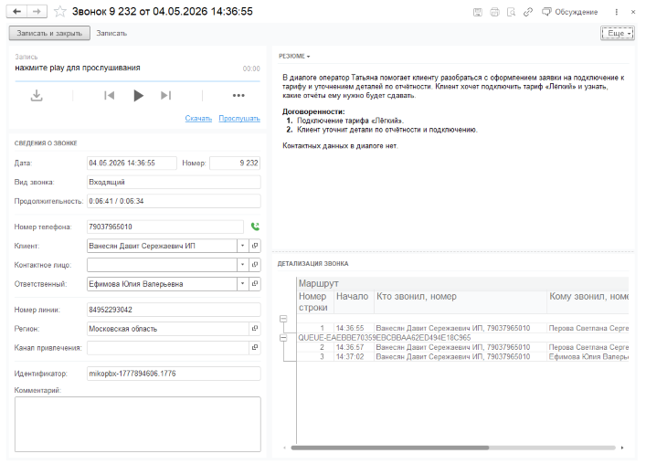

Этот раздел поможет быстро понять, какие задачи закрывает контакт-центр и куда перейти за подробной информацией по
настройке.

::: {.miko-tour-section .background-blue}
## Клиентские обращения внутри 1С

Расширение добавляет в 1С рабочее место для коммуникаций с клиентами. Сотрудники могут обрабатывать звонки,
сообщения из мессенджеров и email, а история обращений остается связанной с клиентской базой и рабочими документами.

{.miko-art}

:::: {.card-container-white .no-pointer}
[!card layout="signal" title="Единая история" text="Разговоры и переписки не остаются в личных телефонах и отдельных приложениях." icon="none"](#)
[!card layout="signal" title="Работа по очередям" text="Новые обращения направляются в нужную команду и получают ответственного." icon="none"](#)
[!card layout="signal" title="Контроль качества" text="Руководителю проще проверять скорость ответа, записи разговоров и результаты обработки." icon="none"](#)
::::

:::

::: {.miko-tour-section .background-yellow}
## Звонки и записи разговоров

Интеграция с телефонией помогает сотрудникам быстрее звонить клиентам, видеть контекст входящего вызова и сохранять
историю разговоров в 1С. Это особенно важно для продаж, поддержки и сервисных подразделений.

{.miko-art}

{.list-icon}
- :icon-check: Звонок можно инициировать из карточки клиента или рабочего документа.
- :icon-check: Записи разговоров помогают разбирать спорные ситуации и обучать сотрудников.
- :icon-check: Пропущенные вызовы проще вернуть в работу, потому что они фиксируются в системе.

[!button text="Подробнее о телефонии" variant="secondary"](telephony/calls-configuration.md)

:::

::: {.miko-tour-section .background-blue}
## Мессенджеры и email

Клиент может написать в WhatsApp, Telegram, MAX или на электронную почту. Для сотрудников это становится единым потоком
обращений, который можно распределять, контролировать и связывать с данными клиента в 1С.

{.miko-art}

{.list-icon}
- :icon-check: Сообщения сохраняются рядом с клиентом, заказом или другим объектом учета.
- :icon-check: Переписку можно направить в нужную очередь или передать другому сотруднику.
- :icon-check: Каналы можно разделить по отделам, брендам или направлениям бизнеса.

[!button text="Подробнее о каналах связи" variant="dark"](administration/channels.md)

:::

::: {.miko-tour-section .background-yellow}
## Обработка обращений

Контакт-центр превращает звонки, сообщения и письма в управляемый поток работы. Обращение попадает в нужную очередь,
оператор видит контекст клиента и обрабатывает его в 1С, а руководитель контролирует задержки, качество и нагрузку
команды.

:::

::: {.miko-tour-subsection .background-mist}
### Очереди обработки

Очереди помогают распределять обращения между группами сотрудников. Например, обращения из WhatsApp можно направлять
в продажи, email — в сервис, а отдельный канал — руководителю направления.

    <article class="miko-tour-feature">
        

            
        

        
Ответственная команда

        
Обращение попадает не в личный телефон, а в рабочую очередь отдела.

    </article>
    <article class="miko-tour-feature">
        

            
        

        
Маршрутизация по каналам

        
Обращения из разных каналов можно направлять в продажи, сервис, поддержку или отдельное направление.

    </article>
    <article class="miko-tour-feature">
        

            
        

        
Автоматические сообщения

        
Система может отвечать при поступлении обращения, отсутствии операторов или закрытии чата.

    </article>

[!button text="Подробнее об очередях и политиках"](administration/queues.md)

:::

::: {.miko-tour-subsection .background-mist}
### Работа оператора

Оператор работает с обращениями в одном контексте: видит клиента, историю общения и связанные данные 1С. Это помогает
быстрее понять ситуацию, ответить клиенту и зафиксировать результат без переключения между разными каналами.

    <article class="miko-tour-feature">
        

            
        

        
Контекст обращения

        
Перед ответом оператор видит клиента, канал связи, историю звонков и переписок, а также связанные данные 1С.

    </article>
    <article class="miko-tour-feature">
        

            
        

        
Действия в одном окне

        
Из обращения можно ответить клиенту, позвонить, оставить комментарий или передать работу другому сотруднику.

    </article>
    <article class="miko-tour-feature">
        

            
        

        
Telegram центр

        
Сотрудник может отвечать с телефона через Telegram, а клиент продолжает общаться в своем канале.

    </article>

[!button text="Подробнее о Telegram центре"](messenger/telegram-center.md)

:::

::: {.miko-tour-subsection .background-mist}
### Контроль руководителя

Контакт-центр делает коммуникации прозрачнее: видно, какие обращения поступают, кто за них отвечает, где возникают
задержки и какие разговоры требуют внимания.

    <article class="miko-tour-feature">
        

            
        

        
Неразобранные обращения

        
Видно пропущенные звонки, неотвеченные сообщения и обращения, которые требуют реакции.

    </article>
    <article class="miko-tour-feature">
        

            
        

        
Контроль задержек

        
Если клиент ждет слишком долго, руководитель может получить уведомление.

    </article>
    <article class="miko-tour-feature">
        

            
        

        
Качество общения

        
Записи разговоров и история переписок помогают разбирать спорные ситуации и оценивать работу по фактам.

    </article>

[!button text="Подробнее о политиках обработки обращений"](administration/queues.md#политика-обработки-обращений)

:::

::: {.miko-tour-section .background-blue}
## Отчеты и аналитика

Отчеты показывают, как работает контакт-центр: сколько обращений поступает, где команда не успевает отвечать,
какие каналы приводят клиентов и на кого приходится основная нагрузка.

{.miko-art}

:::: {.card-container-white .no-pointer}
[!card layout="signal" title="Сводка по обращениям" text="Количество звонков и общая статистика по чатам помогают быстро оценить объем работы за день, неделю или месяц." icon="none"](#)
[!card layout="signal" title="Нагрузка команды" text="Отчеты по сотрудникам и очередям показывают, кто обрабатывает звонки и чаты, где появляются задержки и кому нужна помощь." icon="none"](#)
[!card layout="signal" title="Каналы привлечения" text="Распределение звонков по номерам помогает сравнивать источники клиентов и понимать, какие каналы дают больше обращений." icon="none"](#)
::::

:::

::: {.miko-tour-section .background-yellow}
## AI-анализ диалогов

AI-сервисы могут переводить записи разговоров в текст, анализировать звонки и чаты, формировать краткие резюме,
выделять договоренности, задачи и тему обращения. Это ускоряет восстановление контекста и контроль качества.

{.miko-art}

{.list-icon}
- :icon-check: Краткое резюме помогает понять суть разговора без полного прослушивания.
- :icon-check: Задачи и договоренности проще перенести в работу.
- :icon-check: История взаимодействий может использоваться для более точной маршрутизации звонка.

[!button text="Подробнее об AI-анализе" variant="secondary"](ai/dialog-analyze.md)

:::

## С чего начать

Если вы знакомитесь с продуктом впервые, начните с общего подключения, затем добавьте каналы связи, настройте
пользователей и распределение обращений.

[!button text="Первоначальная настройка"](guides/get-started.md)
