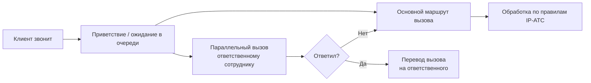

Контакт-центр может автоматически переводить входящий вызов на сотрудника, ответственного за клиента.

Механизм работает следующим образом: пока клиент прослушивает голосовое приветствие или ожидает ответа в очереди,
IP-АТС инициирует параллельный вызов ответственному сотруднику. Если сотрудник принимает этот вызов, входящий вызов
переводится на него. Если сотрудник не отвечает, вызов продолжает обрабатываться по маршруту, настроенному на IP-АТС.

Такой сценарий позволяет направить клиента сразу на ответственного сотрудника, не нарушая основной маршрут обработки
вызова, если сотрудник недоступен.

## Настройка перехвата вызова

{.miko-man}
1. В панели разделов выберите [!badge Контакт-центр] :icon-chevron-right: [!badge Настройки] :icon-chevron-right: [!badge Настройки контакт-центра].
2. Далее в группе [!badge Настройки телефонии] нажмите [!badge Перехват вызова].
3. В поле [!badge Определение ответственного] выберите способ определения сотрудника, 
   на которого будет направляться параллельный вызов.
   
   По значению реквизита
   : Ответственный сотрудник указывается в реквизите карточки контрагента.
   
   Автоматически
   : Ответственный сотрудник определяется алгоритмами модуля маршрутизации.
   Подробнее о модуле маршрутизации см. на странице [Авто генерация IVR](/ai/call-routing.md).
